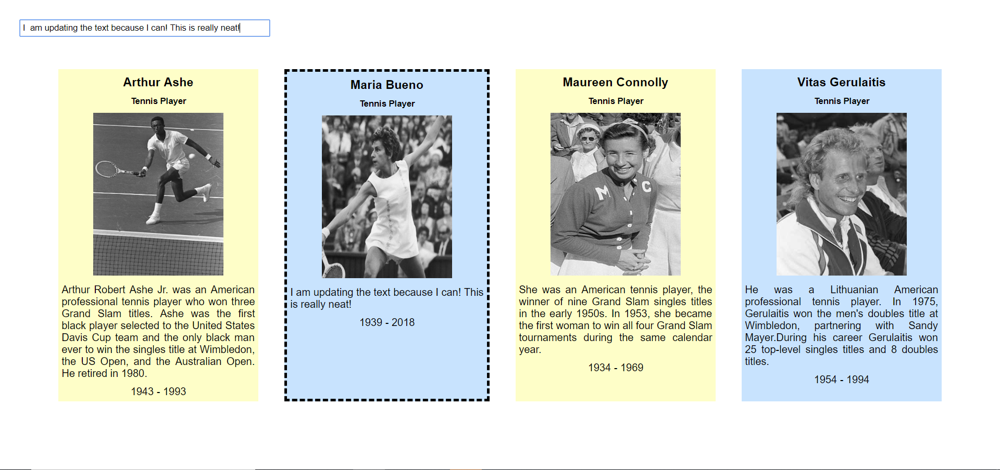

# What You See Is What You Get (WYSIWYG)

### Description
This was a bonus javaScript assignment to practice traversing the DOM. 

### Screenshots

Edit 1 Card

Edit 2 Cards At Once


### How to run app
 * Use npm to install http-server in your terminal:
```sh
npm install -g http-server
```
* Run the server in your terminal
```sh
hs -p 9999
```
* Open chrome and navigate to:
```
localhost:9999
```

 ### Contributors
[Maggie Leavell](https://github.com/mjleavell)